# Machine Learning Experiments Repository

Welcome to the **Machine Learning Experiments** repository. This project is a comprehensive collection of machine learning workflows, preprocessing techniques, dimensionality reduction models, and data visualization experiments.

The codebase is organized into structured Jupyter Notebooks (`.ipynb` files) that demonstrate various stages of the machine learning pipeline, using popular Python libraries like `scikit-learn`, `pandas`, `numpy`, `seaborn`, and `matplotlib`.

---

## 📋 Table of Contents
1. [Experiment 1: Boston House Price Prediction (Linear Regression)](#-experiment-1-boston-house-price-prediction-linear-regression)
2. [Experiment 2: Classifier Performance Comparison (Iris Dataset)](#-experiment-2-classifier-performance-comparison-iris-dataset)
3. [Experiment 4: Basic Data Inspection & Exploration (Pre-owned Cars Dataset)](#-experiment-4-basic-data-inspection--exploration-pre-owned-cars-dataset)
4. [Experiment 5: Descriptive Statistics & Visual Distributions](#-experiment-5-descriptive-statistics--visual-distributions)
5. [Experiment 6: Data Cleaning & Preprocessing (Missing Values & Outliers)](#-experiment-6-data-cleaning--preprocessing-missing-values--outliers)
6. [Experiment 7: Feature Engineering & Preprocessing (Iris Dataset)](#-experiment-7-feature-engineering--preprocessing-iris-dataset)
7. [Experiment 8: Dimensionality Reduction using PCA](#-experiment-8-dimensionality-reduction-using-pca)
8. [Experiment 9: Handling Class Imbalance in Classification](#-experiment-9-handling-class-imbalance-in-classification)
9. [Experiment 10: Extensive Exploratory Data Analysis & Visualizations](#-experiment-10-extensive-exploratory-data-analysis--visualizations)

*Note: Experiment 3 is omitted as it is not part of this experimental set.*

---

## 📈 Experiment 1: Boston House Price Prediction (Linear Regression)

### 🔍 Overview & Objective
Predict the median value of owner-occupied homes (`MEDV`) in Boston using linear regression techniques. This experiment showcases the baseline performance of a standard linear regression model on continuous output targets.

### 🛠️ Libraries & Dataset
- **Dataset**: Boston Housing Dataset (`housing.csv`)
- **Core Tools**: `sklearn.linear_model.LinearRegression`, `sklearn.model_selection.train_test_split`

### 📊 Results & Key Metrics
- **Mean Absolute Error (MAE)**: `64,277.29`
- **Mean Squared Error (MSE)**: `6.79e9`
- **R-squared ($R^2$)**: `0.691` (69.1% of target variance explained by the model)

### 🖼️ Visualizations
| Feature Relationships | Regression Fit (RM vs MEDV) |
|:---:|:---:|
| 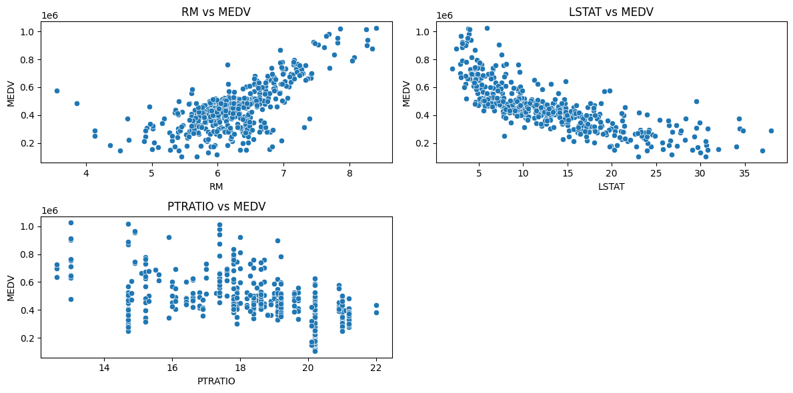 | 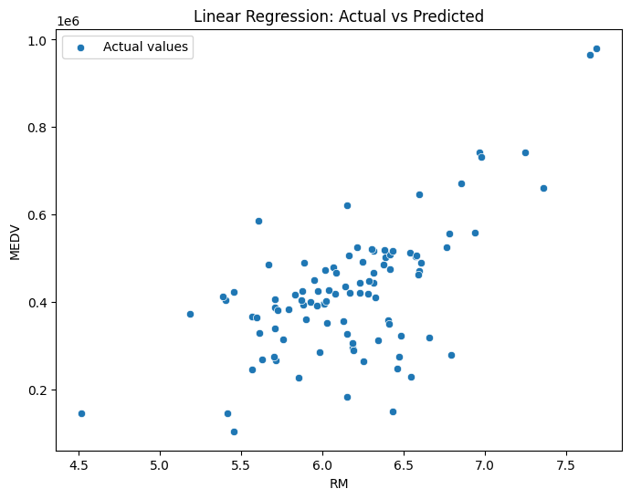 |
| 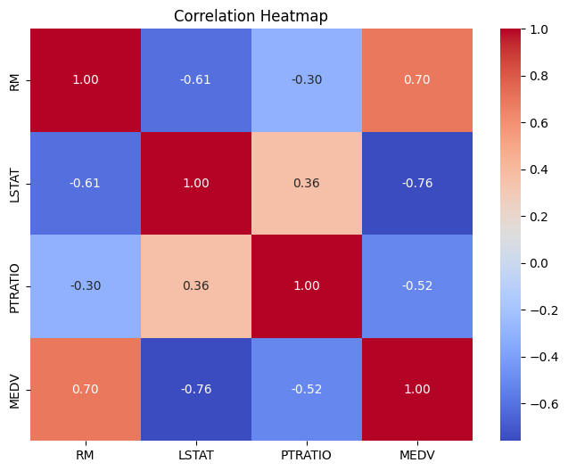 | *Fitted regression line mapping rooms (RM) to median house values.* |

---

## 🏷️ Experiment 2: Classifier Performance Comparison (Iris Dataset)

### 🔍 Overview & Objective
A comparative study of multiple supervised classification algorithms. We evaluate how different boundaries learn to distinguish between three species of Iris flowers (*Setosa, Versicolor, and Virginica*).

### 🛠️ Libraries & Dataset
- **Dataset**: Iris Dataset (150 rows, 4 features)
- **Algorithms Tested**:
  - Random Forest Classifier
  - Support Vector Machine (SVM)
  - K-Nearest Neighbors (KNN)
  - Decision Tree Classifier

### 📊 Results & Performance
All classifiers achieved **100% classification accuracy** on the standardized validation split, demonstrating the linearly separable nature of portions of the Iris dataset.

```
Random Forest Accuracy: 1.0000
Support Vector Machine Accuracy: 1.0000
K-Nearest Neighbors Accuracy: 1.0000
Decision Tree Accuracy: 1.0000
```

### 🖼️ Visualizations
Below are the classification performance matrices and boundaries:
<p align="center">
  
  
</p>
<p align="center">
  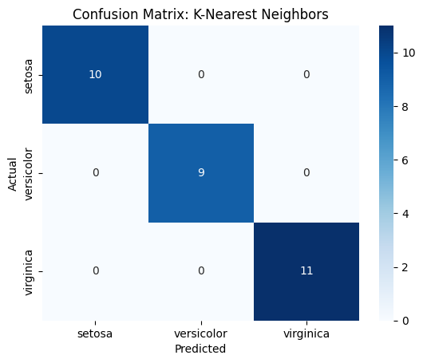
  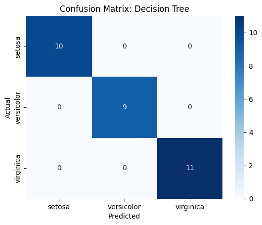
</p>

---

## 📂 Experiment 4: Basic Data Inspection & Exploration (Pre-owned Cars Dataset)

### 🔍 Overview & Objective
Performs initial exploratory inspection on the Pre-owned Cars dataset to evaluate schema types, count rows/features, identify missing values, and calculate summary stats.

### 🛠️ Key Details
- **Dataset**: `pre-ownedcars.csv` (2,806 rows, 15 columns)
- **Key Findings**:
  - Missing values identified across multiple variables, with the `reg_year` column having the most missing values (2,086 missing values).
  - Basic statistical moments (sum, average, minimum, maximum) computed for `km_driven`:
    - **Sum**: `138,098,629.48 km`
    - **Average**: `49,215.48 km`
    - **Range**: `450.0 km` to `143,991.0 km`

> [!NOTE]
> This notebook represents the standard initial checklist for raw tabular data ingestion before running cleaning scripts.

---

## 📊 Experiment 5: Descriptive Statistics & Visual Distributions

### 🔍 Overview & Objective
Extends the exploratory analysis of the Pre-owned Cars dataset with descriptive statistics, visualization of feature distributions, and correlation tracking.

### 🛠️ Methodology
Plots individual histograms with Kernel Density Estimates (KDE) to inspect skewed data profiles and compute a correlation heatmap.

### 🖼️ Visualizations
#### Feature Distributions (KDE Histograms)
<p align="center">
  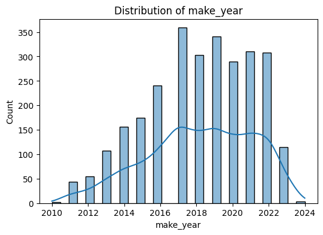
  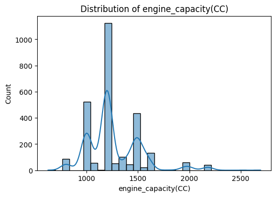
  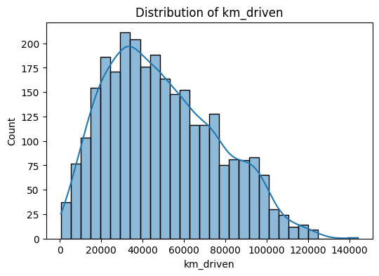
</p>
<p align="center">
  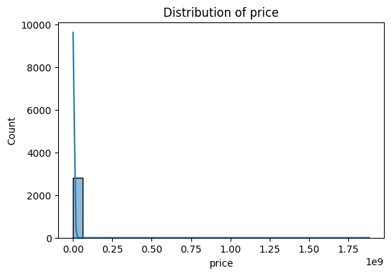
  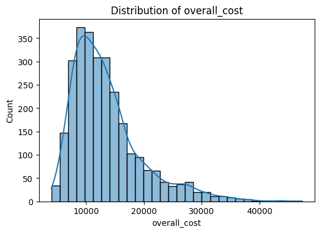
</p>

#### Correlation Heatmap
The heatmap demonstrates dependencies and collinearity among numerical features like `price`, `km_driven`, and `make_year`.
<p align="center">
  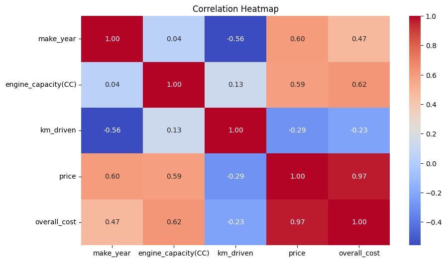
</p>

---

## 🧼 Experiment 6: Data Cleaning & Preprocessing (Missing Values & Outliers)

### 🔍 Overview & Objective
Designed a complete data-cleaning pipeline for the raw pre-owned cars dataset to prepare it for predictive modelling.

### 🛠️ Key Pipeline Steps
1. **Missing Value Imputation**:
   - Replaced missing numerical fields with the column **mean** or **median**.
   - Imputed categorical fields using the **mode** (most frequent class).
   - Handled a total of **2,216 missing values**.
2. **Outlier Mitigation**:
   - Outliers detected using the **Interquartile Range (IQR)** method:
     $$\text{IQR} = Q3 - Q1$$
     $$\text{Lower Bound} = Q1 - 1.5 \times \text{IQR}$$
     $$\text{Upper Bound} = Q3 + 1.5 \times \text{IQR}$$
   - Data points lying outside these boundaries were treated/removed to optimize model robustness.

---

## ⚙️ Experiment 7: Feature Engineering & Preprocessing (Iris Dataset)

### 🔍 Overview & Objective
Demonstrates preprocessing steps required to transform variables before passing them into distance-sensitive or gradient-descent algorithms.

### 🛠️ Workflow & Key Concepts
- **Feature Scaling (Standardization)**: Transforms numerical variables (`sepal_length`, `sepal_width`, etc.) using `StandardScaler` to have a mean of 0 and standard deviation of 1.
- **One-Hot Encoding**: Encodes categorical variables (`species`) into multiple boolean binary indicators.
- **Memory Optimization Analysis**: Showcases that transforming categorical variables to one-hot and boolean formats reduces dataframe memory footprints (from **14,728 bytes** down to **5,378 bytes**).

---

## 🌀 Experiment 8: Dimensionality Reduction using PCA

### 🔍 Overview & Objective
Apply **Principal Component Analysis (PCA)** on the Pre-owned Cars dataset to project higher-dimensional numerical attributes into a lower-dimensional subspace while maintaining maximum variance.

### 🛠️ Analysis
- Scaled numerical features: `engine_capacity(CC)`, `km_driven`, `price`, and `overall_cost`.
- **Explained Variance Ratio** per Principal Component:
  - PC1: **40.4%**
  - PC2: **27.0%**
  - PC3: **25.0%**
  - PC4: **7.5%**
- Retaining 95% of total dataset variance requires keeping all **4** principal components.

### 🖼️ Visualizations
#### PCA Projection (PC1 vs PC2 Scatter Plot)
Below is the visualization of the dataset mapped onto the first two principal components:
<p align="center">
  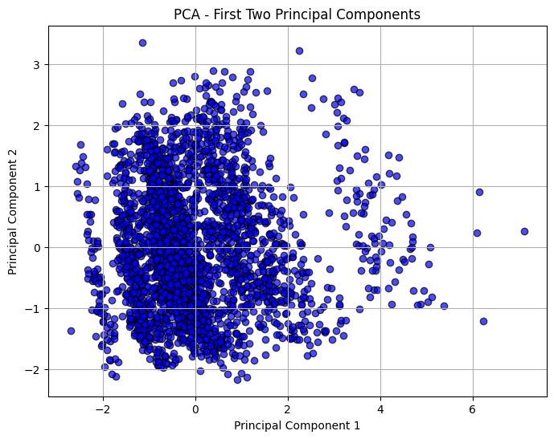
</p>

---

## ⚖️ Experiment 9: Handling Class Imbalance in Classification

### 🔍 Overview & Objective
Imbalanced datasets bias models toward the majority class. This experiment evaluates various resampling and cost-sensitive strategies on a synthetic dataset containing **900 majority class (0)** and **100 minority class (1)** observations.

### 🛠️ Strategies Tested (with Logistic Regression)
1. **Original Imbalanced baseline**
2. **Random Oversampling (ROS)**
3. **Random Undersampling (RUS)**
4. **SMOTE** (Synthetic Minority Over-sampling Technique)
5. **Class Weighting** (Cost-sensitive training)

### 📊 Results Summary
- **SMOTE** and **Random Oversampling** yielded the best recall improvement on class 1.
- **Random Undersampling** suffered from high information loss, leading to a reduced overall AUC score.
- **SMOTE** achieved the best balance between recall and overall ROC-AUC performance.

### 🖼️ Visualizations
#### ROC-AUC Comparison
<p align="center">
  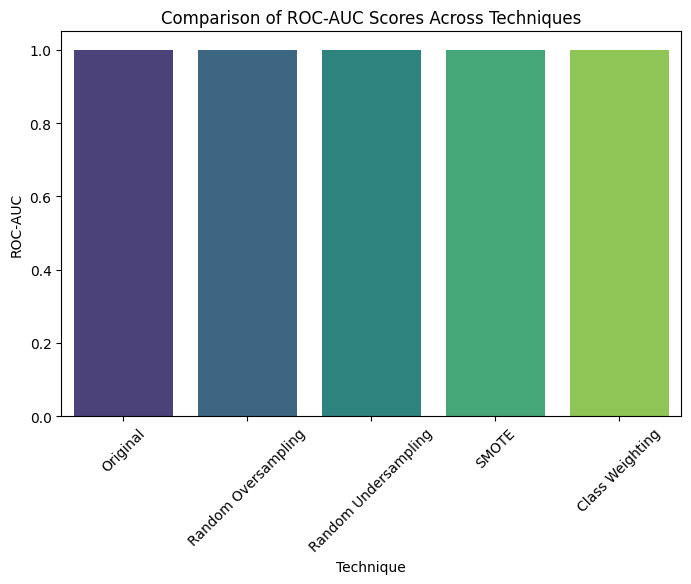
</p>

---

## 🌸 Experiment 10: Extensive Exploratory Data Analysis & Visualizations

### 🔍 Overview & Objective
An exhaustive visual deep-dive of the Iris dataset to showcase the variety of plots available under seaborn and matplotlib for statistical data visualization.

### 🖼️ Visualizations

#### 1. Distribution & Pairplots
<p align="center">
  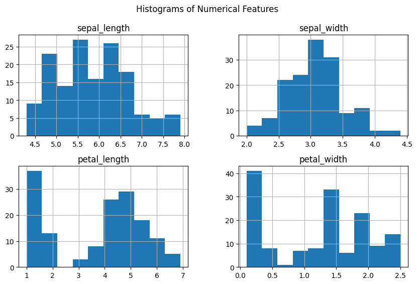
  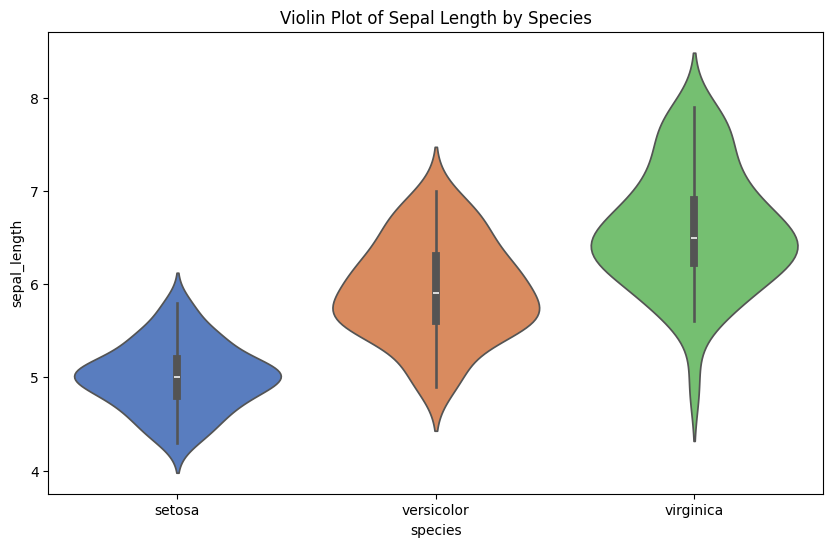
</p>
*Left: Histograms of the four features. Right: Pairplot showing scatter plots grouped by flower species.*

#### 2. Class Distributions & Scatter Analysis
<p align="center">
  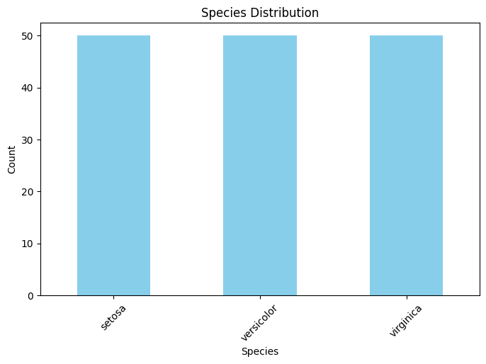
  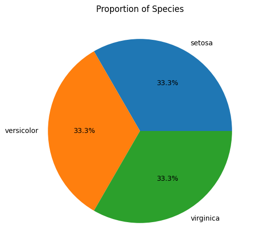
  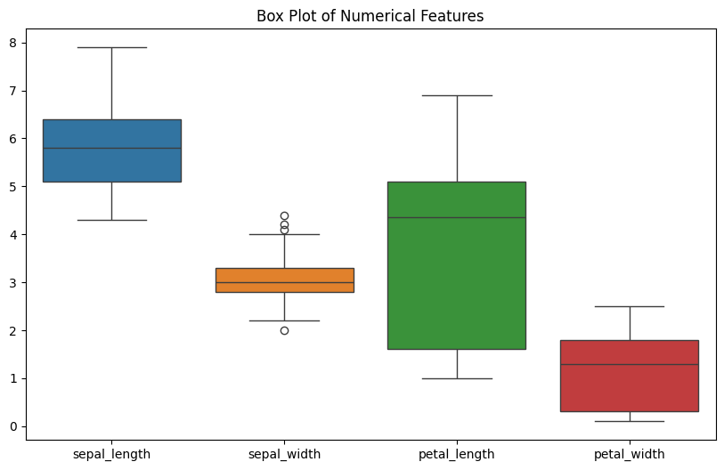
</p>
*From left to right: Species counts, Sepal length vs width scatter, Petal length vs width scatter.*

#### 3. Correlation & Outliers
<p align="center">
  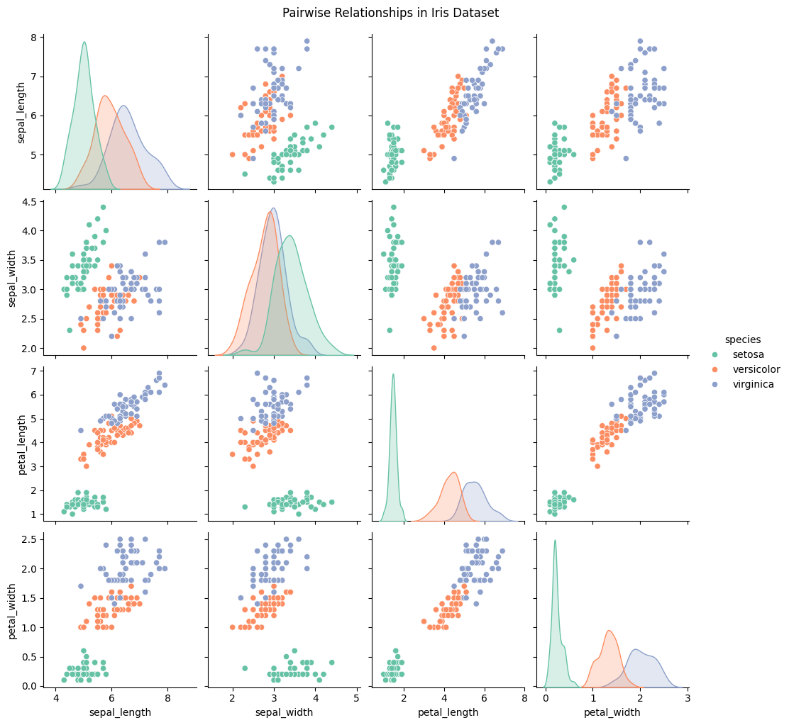
  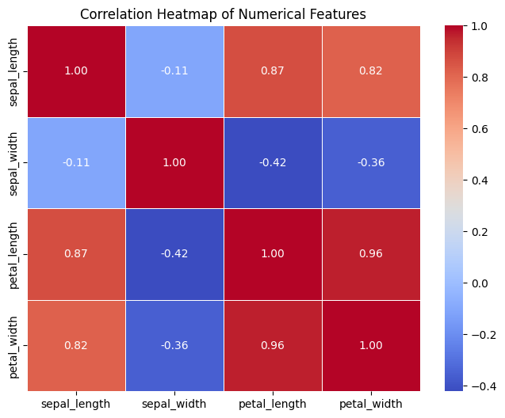
</p>
*Left: Correlation Heatmap. Right: Species-wise box plots showing feature range and median values.*
